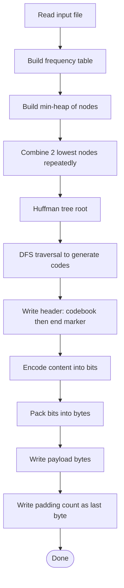

# HuffmanCoding module

This module implements **Huffman coding**: a lossless entropy coding technique that assigns shorter bit-codes to more frequent symbols and longer bit-codes to less frequent symbols. The compressor reads an input file, builds a frequency table (multi-threaded), constructs a Huffman tree, generates prefix codes, writes a header that stores the codebook, and then writes a bit-packed payload plus a final padding byte.

## Files & responsibilities

### `HuffmanCoding.hpp`
Defines the `HuffmanCoding` class and its internal structures.

- `class HuffmanCoding`
  - `int encode(const std::string& text)`
    - Despite the parameter name (`text`), the implementation treats it as a **file path**.
    - Reads file, builds codes, writes `output.txt`.
  - `int decode(const std::string& encodedText)`
    - Treats parameter as a **compressed file path**.
    - Reads compressed file, parses header, writes `decoded_output.txt`.

- Internal structures:
  - `struct Node`
    - Represents a Huffman tree node:
      - `ch`: stored character (for leaf nodes)
      - `freq`: frequency of the character(s)
      - `left/right`: children
    - `isLeaf()` checks if node has no children.
  - `struct Compare`
    - Comparator for the priority queue to build a min-heap by frequency.

- Internal state:
  - `Node* root` : root of Huffman tree.
  - `unordered_map<char, string> huffmanCodes` : char → Huffman bitstring.
  - `unordered_map<char, unsigned long long> freqTable` : char → frequency.

- Internal helper methods:
  - `buildFrequencyTable(text)` : counts character frequencies (multi-threaded).
  - `buildTree()` : uses a min-heap to combine least-frequent nodes.
  - `generateCodes(node, code)` : DFS traversal to produce prefix codes.
  - `getHeader()` : builds a serialized header from `huffmanCodes`.
  - `freeTree(node)` : recursive cleanup.

> Note: `compress()` is declared but not implemented/used in the provided `.cpp`.

---

### `HuffmanCoding.cpp`
Implements compression/decompression logic.

#### Frequency table (multi-threaded)
- `buildFrequencyTable(const std::string& text)`
  - Splits input text into chunks based on `std::thread::hardware_concurrency()`.
  - Each worker counts local frequencies.
  - Merges into global `freqTable` using a mutex (`freqMutex`).

#### Tree construction
- `buildTree()`
  - Pushes `(character, frequency)` as leaf nodes into a priority queue.
  - Pops two smallest, merges into a parent node whose frequency is sum.
  - Repeats until a single root remains.

#### Code generation
- `generateCodes(node, code)`
  - DFS:
    - left edge appends `"0"`
    - right edge appends `"1"`
  - Handles edge-case of single unique character: assigns `"0"`.

#### Header format
- `getHeader()`
  - Serializes each `(char, code)` as:
    - `<char>|<code>` followed by a separator `` ` ``
  - End of header marker: `"~~"`

So header layout is effectively:
```
c|101`a|00`...~~
```

#### Encoding (`encode(fileName)`)
- Reads entire file into a string `content`.
- Builds `freqTable`, tree, and `huffmanCodes`.
- Opens `output.txt` in binary mode.
- Writes header (codebook).
- Encodes payload:
  - For each character:
    - looks up its Huffman code (string of '0'/'1')
    - packs bits into an `unsigned char buffer`
    - writes full bytes when buffer reaches 8 bits
- Pads remaining bits at end (if needed)
- Writes a final byte containing the padding count (0–7).

Output layout:
1) header text
2) compressed bytes
3) last byte = padding count

#### Decoding (`decode(filename)`)
- Reads full compressed file into memory.
- Parses the header until `"~~"` is encountered:
  - reads `character`
  - expects `'|'`
  - reads `code` until `` ` ``
  - stores mapping `codeToChar[code] = character`
- Reads padding count from the last byte.
- Converts compressed bytes to a bit-string using `std::bitset<8>`.
- Removes padding bits from the end.
- Decodes by accumulating bits into `currentCode` and matching `codeToChar`.
- Writes result to `decoded_output.txt`.

---

### `main.cpp`
A tiny CLI wrapper.

Usage behavior:
- `argv[1] == "compress"` → `obj.encode(argv[2])`
- otherwise → `obj.decode(argv[2])`

So the CLI expects:
```bash
./huffman compress <input_file>
./huffman decompress <compressed_file>
```

> The program prints `argv[1] argv[2]` and does not validate `argc`.

---

## Huffman algorithm (working diagram)



## Notes / gotchas
- `encode()` writes to a fixed output name: `output.txt`
- `decode()` writes to a fixed output name: `decoded_output.txt`
- Header uses delimiters `|`, `` ` ``, and terminator `~~`
- `compress()` is declared in the header but not implemented in the `.cpp`
