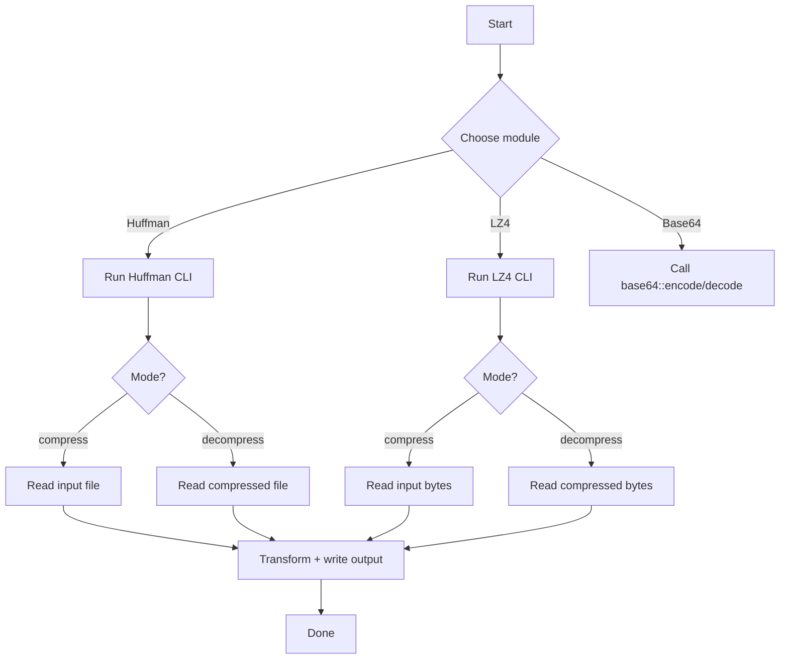

# File Compressor (C++)

This repository contains a small C++ collection of file **compression / encoding** utilities implemented from scratch. It currently includes:

- **Huffman Coding** (lossless entropy coding)
- **LZ4 (simplified)** (lossless LZ77-style dictionary compression)
- **Base64** (binary-to-text encoding)

Each algorithm is implemented as an isolated module with its own entrypoint so you can study, run, and benchmark them independently.

## Architecture

At a high level, the repo is organized as three self-contained modules (each with its own `main.cpp` or callable API):

- `HuffmanCoding/` → Huffman-based compressor/decompressor that writes a small header + bitpacked payload.
- `lz4/` → simplified LZ4-style compressor/decompressor operating on raw bytes (`std::vector<uint8_t>`).
- `base64/` → multithreaded base64 encoder/decoder operating in 1MB chunks.

```mermaid
flowchart TB
    subgraph Repo[prannavdeshpande/file-compressor]
      HC[HuffmanCoding/]
      B64[base64/]
      LZ[lz4/]
    end

    HC --> HCMain[main.cpp (CLI)]
    HC --> HCLib[HuffmanCoding.hpp/.cpp]

    B64 --> B64Lib[base64.h/.cpp]

    LZ --> LZMain[main.cpp (CLI)]
    LZ --> LZLib[lz4.h/.cpp]

    HCMain -->|compress / decompress| Files[(Input file)]
    LZMain -->|compress / decompress| Files
    B64Lib -->|encode / decode| Files
```

## Key features

- Lossless compression with **Huffman Coding** (bitpacking + header for code table)
- Lossless compression with **LZ4-style** tokens (literals + back-references)
- **Base64** encode/decode with chunk-based multithreading
- Minimal dependencies (standard C++ library)

## Activity / flow (typical CLI usage)



## Getting started (quick glance)

> The repo is pure C++. There is no single unified build script yet; each module can be built independently.

### Build & run: Huffman

```bash
g++ -std=c++17 -O2 HuffmanCoding/main.cpp HuffmanCoding/HuffmanCoding.cpp -o huffman
./huffman compress <input_file>
./huffman decompress output.txt
```

Outputs:
- `output.txt` (binary) for compression
- `decoded_output.txt` for decompression

### Build & run: LZ4

```bash
g++ -std=c++17 -O2 lz4/main.cpp lz4/lz4.cpp -o lz4tool
./lz4tool compress <input_file> <output_file>
./lz4tool decompress <input_file> <output_file>
```

### Using Base64

Base64 is exposed as a small API (`base64::encode`, `base64::decode`). You can call it from your own `main.cpp`:

```cpp
#include "base64/base64.h"

int main() {
  base64::encode("in.bin", "out.b64", 4);
  base64::decode("out.b64", "roundtrip.bin", 4);
}
```

---

## Module docs

- `HuffmanCoding/HUFFMAN_CODING.md`
- `base64/BASE64.md`
- `lz4/LZ4.md`