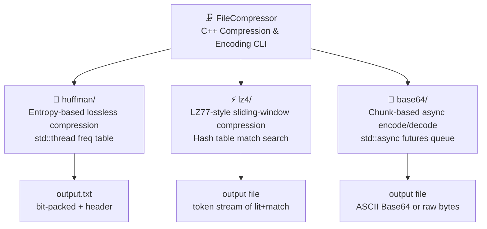

# 🗜️ FileCompressor

> A modular C++ toolkit for file compression and encoding — featuring Huffman coding, LZ4-style fast compression, and Base64 encoding, all built with async/multi-threaded processing.

---

## 📖 What is FileCompressor?

FileCompressor is a from-scratch C++ project that implements three classic data encoding and compression algorithms: **Huffman Coding**, a simplified **LZ4-style compressor**, and **Base64 encoding**. Each module is self-contained and production-inspired — using real techniques like chunk-based async I/O, multi-threaded frequency analysis, bit-packing, and LZ77-style back-reference matching. Whether you're learning how compression works under the hood, exploring C++ concurrency primitives, or building a foundation for a larger pipeline, FileCompressor is a clean, readable codebase to study and extend.

---

## ✨ Features

- **🌳 Huffman Coding** — Entropy-based lossless compression. Builds a frequency table using `std::thread` parallelism, constructs a min-heap Huffman tree, generates optimal prefix codes, and writes a compact bit-packed output with a serialised codebook header.

- **⚡ LZ4-Style Compression** — A simplified LZ77 variant inspired by the LZ4 format. Uses a sliding-window hash table to find back-references in previously seen data, emitting tokens of (literals + match offset + match length) for fast, byte-level compression.

- **🔐 Base64 Encoding / Decoding** — Chunk-based Base64 encode and decode with configurable async parallelism via `std::async`. Processes files in 1MB chunks, throttles concurrency with a futures queue, and handles `=` padding correctly at boundaries.

- **🧵 Multi-threaded by default** — Huffman's frequency analysis splits work across all hardware threads. Base64 uses `std::async` futures with a configurable thread limit. Designed for real throughput on large files.

- **📦 Modular architecture** — Each algorithm lives in its own directory with its own header, implementation, and `main.cpp` CLI wrapper. Drop in just the module you need.

- **🖥️ CLI-first design** — Every module ships with a command-line interface for immediate use without writing any integration code.

---

## 🏗️ Architecture
```
FileCompressor/
├── README.md               ← You are here
├── huffman/
│   ├── HuffmanCoding.hpp
│   ├── HuffmanCoding.cpp
│   ├── main.cpp
│   └── README.md           ← Module-level docs
├── lz4/
│   ├── lz4.h
│   ├── lz4.cpp
│   ├── main.cpp
│   └── README.md           ← Module-level docs
└── base64/
    ├── base64.h
    └── base64.cpp
```

### How it all fits together


### Module deep-dives

**Huffman flow:**
```
Input file → [multi-threaded freq table] → min-heap tree → DFS prefix codes
         → write header (char|code`...~~) → bit-pack payload → padding byte
```

**LZ4 flow:**
```
Input bytes → sliding window (65535B) → hash table match search
           → emit token (litLen nibble | matchLen nibble) + literals + offset
           → flush remaining literals
```

**Base64 flow:**
```
Input file → 1MB chunks → std::async encode_chunk / decode_chunk
          → futures queue (throttled to N threads) → write output
```

---

## 🚀 Getting Started

### Prerequisites

- C++17 or later
- A C++ compiler: `g++`, `clang++`, or MSVC
- `make` (optional, for build scripts)

### Build & Run — Huffman
```bash
cd huffman
g++ -std=c++17 -O2 -pthread HuffmanCoding.cpp main.cpp -o huffman

# Compress a file
./huffman compress ../myfile.txt

# Decompress
./huffman decompress output.txt
```

> 📄 For full Huffman documentation, header formats, and gotchas → **[huffman/README.md](./HuffmanCoding/README.md)**

---

### Build & Run — LZ4
```bash
cd lz4
g++ -std=c++17 -O2 lz4.cpp main.cpp -o lz4

# Compress
./lz4 compress input.bin output.lz4

# Decompress
./lz4 decompress output.lz4 restored.bin
```

> 📄 For full LZ4 documentation, token format, and known limitations → **[lz4/README.md](./lz4/README.md)**

---

### Build & Run — Base64

Base64 is a library module (no standalone CLI). Integrate it directly:
```cpp
#include "base64/base64.h"

// Encode with 4 async threads
base64::encode("input.bin", "output.b64", 4);

// Decode
base64::decode("output.b64", "restored.bin", 4);
```
```bash
g++ -std=c++17 -O2 base64/base64.cpp your_main.cpp -o myapp
```

---

## 📁 Sub-module Documentation

| Module | Description | Docs |
|--------|-------------|------|
| 🌳 Huffman | Entropy coding, multi-threaded freq analysis, bit-packed output | [huffman/README.md](./HuffmanCoding/README.md) |
| ⚡ LZ4 | LZ77-style sliding window compression, hash-table match search | [lz4/README.md](./lz4/README.md) |
| 🔐 Base64 | Async chunk-based encoding/decoding, configurable thread count | *(see base64.h)* |

---

## ⚠️ Known Limitations

- Huffman `encode()` and `decode()` write to **fixed output filenames** (`output.txt`, `decoded_output.txt`) — configurable paths are a planned improvement.
- LZ4 is a **simplified educational implementation** and is not byte-compatible with the official LZ4 format.
- Base64 `threads` parameter must be `> 0` for meaningful concurrency throttling.
- The LZ4 hash table uses a static allocation — repeated calls in the same process share hash state.

---

## 🤝 Contributing

Contributions welcome! If you're a student, C++ developer, or just curious — feel free to open issues, suggest improvements, or submit PRs for:

- Configurable output paths in Huffman
- Official LZ4 format compatibility
- A unified CLI combining all three modules
- Benchmarks and compression ratio comparisons
