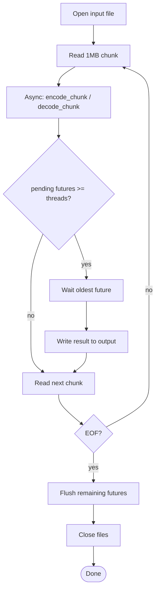

# base64 module

This module implements Base64 **encoding and decoding** for files. It uses **chunk-based processing (1MB chunks)** and can execute chunk operations asynchronously using `std::async`, allowing limited parallelism controlled by the `threads` parameter.

> Base64 is an *encoding* (not compression): output may be larger than input.

## Files & responsibilities

### `base64.h`
Public API declaration:

- `class base64`
  - `static void encode(const std::string &inFile, const std::string &outFile, size_t threads);`
  - `static void decode(const std::string &inFile, const std::string &outFile, size_t threads);`

`threads` controls how many outstanding async tasks are allowed before the caller waits and flushes results.

---

### `base64.cpp`
Implementation of chunk-based Base64 encode/decode.

#### Constants
- `chunkSize = 1024 * 1024` (1MB)
- `b64_chars = "ABCDEFGHIJKLMNOPQRSTUVWXYZabcdefghijklmnopqrstuvwxyz0123456789+/"`

#### Encoding
- `encode_chunk(vector<unsigned char>& data) -> string`
  - Converts input bytes in groups of 3:
    - Produces 4 Base64 characters
    - Uses `=` for padding if fewer than 3 bytes remain.

- `base64::encode(inFile, outFile, threads)`
  - Opens input in binary, output in text.
  - Reads 1MB into a `vector<unsigned char>`.
  - Launches `encode_chunk` via `std::async`.
  - When number of pending futures reaches `threads`, it:
    - waits for the oldest future
    - writes its output
    - erases it from the queue
  - Flushes remaining futures at end.

#### Decoding
- `b64_index(char c) -> int`
  - returns index in base64 alphabet, or -1 if not found

- `decode_chunk(const string &input) -> vector<unsigned char>`
  - Collects 4 input Base64 chars at a time
  - Converts them back into 3 bytes (minus any `=` padding)

- `base64::decode(inFile, outFile, threads)`
  - Opens input in text mode, output in binary.
  - Reads chunkSize characters into a string buffer.
  - Ensures the buffer size is divisible by 4 (does not split Base64 quads):
    - pulls extra characters if needed
  - Launches `decode_chunk` via `std::async`.
  - Similar futures throttling as encoding:
    - when pending futures >= `threads`, writes earliest decoded bytes.
  - Flushes remaining futures at end.

---

## Base64 encoding/decoding flow diagram

## Notes / gotchas
- Encoding writes ASCII Base64 text; decoding expects valid Base64 characters (plus `=`).
- Decode logic tries to avoid splitting 4-character Base64 blocks across chunk boundaries.
- The `threads` parameter should be > 0; otherwise the throttling logic won’t behave meaningfully.
