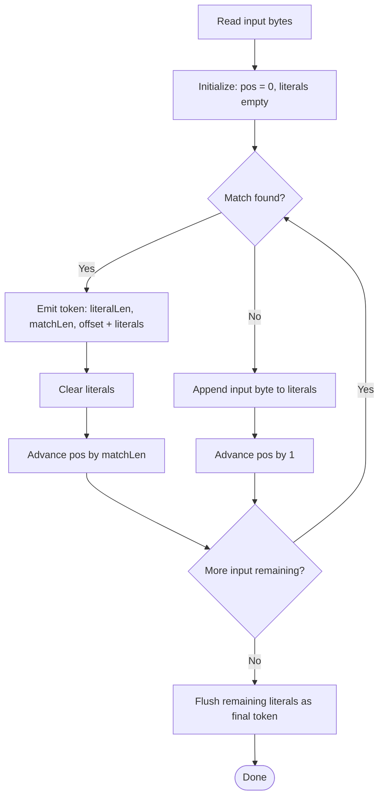

# lz4 module (simplified)

This module is a simplified LZ4-style compressor/decompressor. It operates on raw bytes (`std::vector<uint8_t>`) and emits a stream of tokens representing alternating sequences of:

- **literals** (bytes copied directly), and
- **matches** (back-references into already produced output)

This mirrors the LZ4 philosophy (fast LZ77 variant), but it is not guaranteed to be compatible with the official LZ4 format.

## Files & responsibilities

### `lz4.h`
Declares the compressor/decompressor interface:

- `class SimpleLZ4`
  - `compress(const vector<uint8_t>& input) -> vector<uint8_t>`
  - `decompress(const vector<uint8_t>& compressed) -> vector<uint8_t>`

Private helpers:
- `MIN_MATCH_LENGTH = 4`
- `encodeToken(...)`
  - emits:
    - token byte (literal length nibble + match length nibble)
    - optional literal length extension bytes
    - literal bytes
    - offset (2 bytes, little-endian) if match exists
    - optional match length extension bytes
- `decodeLength(...)`
  - reads extension bytes (255 continuation scheme)
- `findLongestMatch(...)`
  - attempts to find a match using a simple hash table approach

---

### `lz4.cpp`
Implements the codec.

#### Token structure (as implemented)
- Token byte:
  - high 4 bits: `literalLength` (capped at 15)
  - low 4 bits: `matchLength - MIN_MATCH_LENGTH` (capped at 15)

If lengths exceed 15, extra bytes are appended using `appendLength()`:
- write 255 repeatedly while remaining length >= 255
- then write final remainder

#### Compression flow
- Maintains:
  - `literals` buffer for bytes that don’t match
  - sliding window (`WINDOW_SIZE = 65535`)
- At each `pos`, attempts a match:
  - if match found and `matchLen >= MIN_MATCH_LENGTH`
    - emits a token containing current literals + match info
    - clears literals
    - advances by match length
  - else
    - adds current byte to literals
    - advances by 1
- Flushes remaining literals at end

`findLongestMatch`:
- Uses a static hash table (size 2^16) for candidate positions.
- Hashes the next 4 bytes (MIN_MATCH_LENGTH) to find previous occurrence.
- Extends match forward while bytes match.

#### Decompression flow
- Reads token
- Extracts literal length (plus extensions if token nibble is 15)
- Copies literal bytes to output
- If not end of input:
  - reads 2-byte offset
  - extracts match length (plus extensions)
  - copies `matchLength` bytes from `output.size() - offset` forward
    - handles overlap by pushing bytes one by one

Error handling:
- Throws runtime errors on:
  - literal bounds issues
  - missing offset bytes
  - invalid offsets

---

### `lz4/main.cpp`
CLI wrapper for the module.

Usage:
```bash
lz4 <compress|decompress> <input_file> <output_file>
```

Behavior:
- Reads entire input file as bytes
- Runs compress/decompress
- Writes output bytes
- Prints elapsed milliseconds

---

## LZ4-style working diagram



## Notes / gotchas
- This is a simplified educational implementation (not official LZ4 format compatibility guaranteed).
- `findLongestMatch` uses a static hash table: repeated calls in the same process reuse it.
- The code sets `HASH_SIZE = 1<<16` but hashes with `(HASH_BITS - 1)` which is likely unintended; it reduces hash range dramatically. (This affects compression ratio/speed.)
